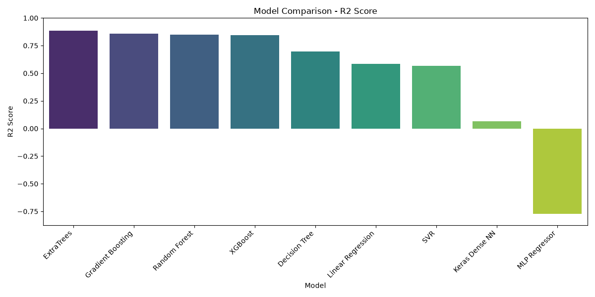
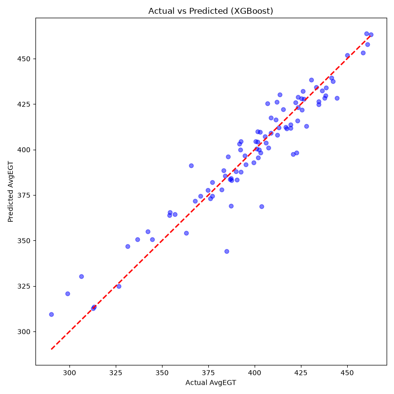
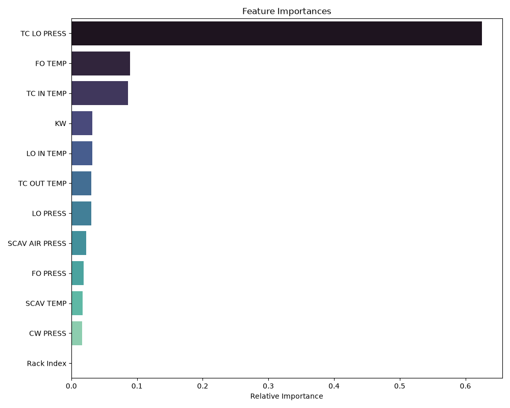
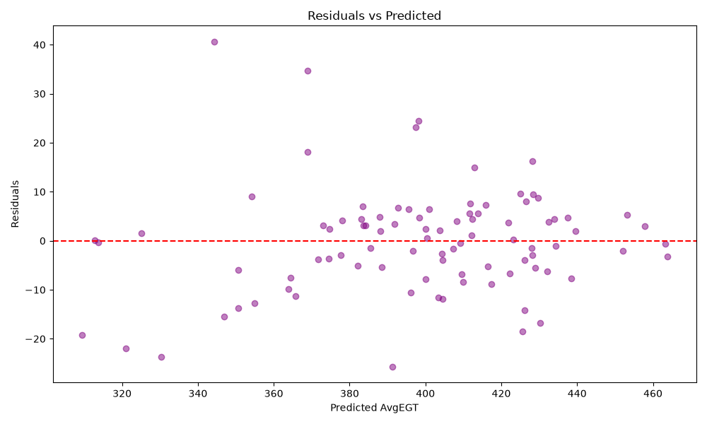

# Aerospace Turbine Engine Exhaust Gas Temperature (AvgEGT) Regression

An industrial predictive maintenance and telemetry regression pipeline designed to predict turbine **Average Exhaust Gas Temperature (`AvgEGT`)** using multi-channel engine telemetry sensors. 

Accurately modeling EGT is vital in aerospace and heavy marine engines to detect thermal degradation, prevent turbine blade burnout, and schedule condition-based maintenance before in-service failure.

---

## The Engineering Problem: Preventing Data Leakage

During initial exploratory data analysis, individual cylinder exhaust temperatures (`EXHAUST TEMP 1` through `6`) were found to mathematically average out directly to the target variable (`AvgEGT`). Including them would result in severe **data leakage**—the model would trivially average the outputs rather than learning actual thermodynamic and mechanical dependencies.

To enforce authentic learning, all individual exhaust sensor columns and redundant electrical variables (`FREQ`, `AMP`, `CPW IN/OUT TEMP`) were programmatically removed. The models were forced to predict thermal behavior solely from **12 mechanical telemetry sensors**:
* **Load**: Active Power (`KW`), Fuel Rack Position (`Rack Index`)
* **Fluid Temperatures**: Lube Oil Inlet (`LO IN TEMP`), Fuel Oil (`FO TEMP`), Scavenge Air (`SCAV TEMP`)
* **Turbocharger Thermodynamics**: Turbine Inlet (`TC IN TEMP`), Turbine Outlet (`TC OUT TEMP`)
* **Pressures**: Lube Oil (`LO PRESS`), Fuel Oil (`FO PRESS`), Cooling Water (`CW PRESS`), Scavenge Air (`SCAV AIR PRESS`), Turbocharger Oil (`TC LO PRESS`)

---

## Benchmark Model Comparison

11 regression algorithms were trained and systematically benchmarked on identical 80/20 train/test splits:

| Rank | Model | $R^2$ Score | MAE (°C) | RMSE (°C) |
| :---: | :--- | :---: | :---: | :---: |
| **1** | **XGBoost (Winning Model)** | **0.9136** | **7.82** | **10.83** |
| 2 | Extra Trees Regressor | 0.8912 | 7.90 | 12.15 |
| 3 | Random Forest Regressor | 0.8810 | 8.62 | 12.71 |
| 4 | LightGBM | 0.8318 | 10.63 | 15.11 |
| 5 | CatBoost Regressor | 0.7763 | 10.40 | 17.43 |
| 6 | Linear Regression | 0.7237 | 14.69 | 19.37 |
| 7 | Ridge Regression | 0.7237 | 14.69 | 19.37 |
| 8 | Lasso Regression | 0.7017 | 14.94 | 20.13 |
| 9 | Decision Tree | 0.6566 | 13.76 | 21.59 |
| 10 | ElasticNet | 0.6256 | 16.37 | 22.55 |
| 11 | Gradient Boosting | 0.3529 | 13.44 | 29.64 |

---

## Empirical Validation Plots

### 1. Model Scoreboard & Actual vs. Predicted EGT
<p align="center">
  
  
</p>

### 2. Feature Importance & Residual Distribution
<p align="center">
  
  
</p>

* **Top Thermodynamic Drivers**: Turbocharger temperatures (`TC IN TEMP`, `TC OUT TEMP`) and Fuel Oil Temperature (`FO TEMP`) exhibit the highest predictive contribution for EGT margins.
* **Residual Analysis**: Residuals are tightly distributed around zero ($pm 7.8^circ	ext{C}$ mean absolute deviation), confirming the absence of systematic bias across operating regimes.

---

## Quick Start & Inference

### 1. Installation
```bash
git clone https://github.com/Rajchhapariya/AvgEGT_Prediction_Project.git
cd AvgEGT_Prediction_Project
python -m venv venv
# Windows: venv\Scripts\activate
pip install -r requirements.txt
```

### 2. Run Real-Time Telemetry Inference
Execute the inference script using the trained winning model (`final_model.pkl`):
```bash
python predict_new_engine_data_REGRESSION.py
```

Sample Output:
```text
Loading data and initializing Regression Model...
--- Executing Inference ---
[INPUT SENSORS]:
  KW: 3200.0 | LO IN TEMP: 48.0 | TC IN TEMP: 450.0 | TC OUT TEMP: 350.0
===========================================
Predicted AvgEGT: 385.31 Degrees
===========================================
```

### 3. Repository Structure
```text
AvgEGT_Prediction_Project/
├── data/raw/                            # Raw engine telemetry data
├── models/                              # Serialized candidate model weights
├── plots/                               # 17 validation and comparison figures
│   ├── 01_model_comparison_r2.png
│   ├── 02_actual_vs_predicted.png
│   ├── 03_feature_importance.png
│   └── regression_model_comparison_scoreboard.csv
├── notebooks/                           # Interactive dashboard notebooks
├── final_model.pkl                      # Serialized winning XGBoost model
├── regression_pipeline.py               # Complete benchmark training pipeline
├── predict_new_engine_data_REGRESSION.py # Standalone CLI inference script
├── MASTER_PROJECT_DOCUMENTATION.md      # Detailed engineering specification
├── REGRESSION_EXPLAINER.md              # Technical notes on leakage prevention
└── requirements.txt                     # Dependencies
```
